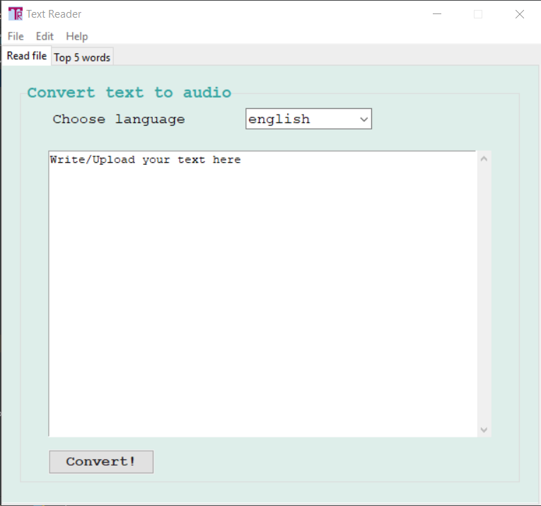
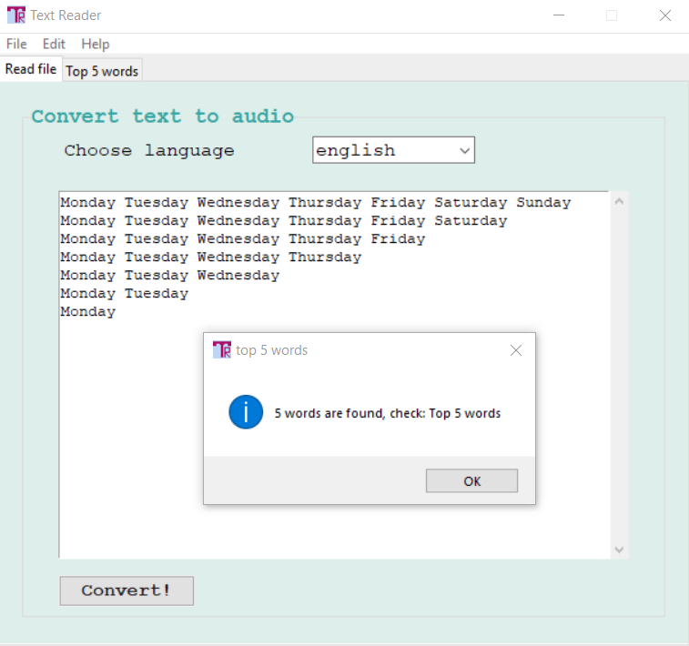
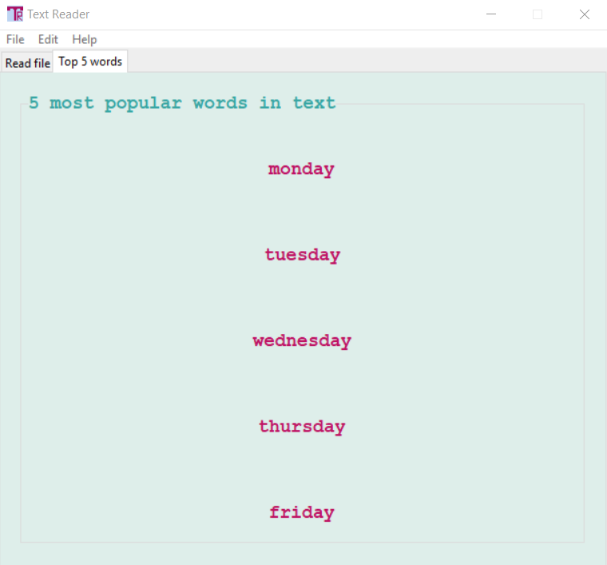
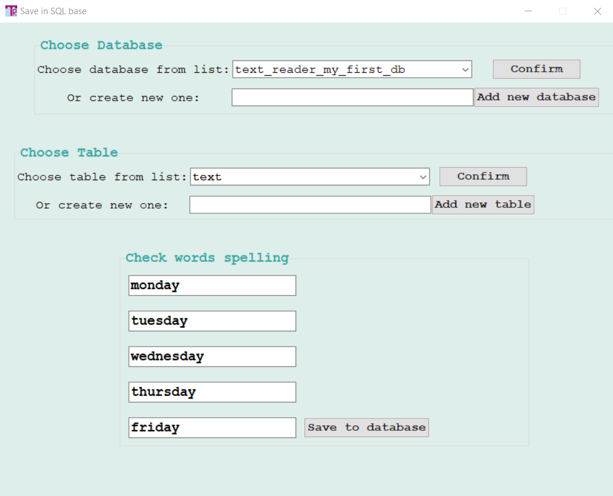

# Text Reader - Tkinter GUI app
GUI app created with Python. It allows you to find the five most common words in the text and convert the text to a mp3 
file.


## Table of contents
* [General info](#general-info)
* [Screenshots](#screenshots)
* [Usage](#usage)
* [Setup](#setup)
* [Technologies](#technologies)

## General info

GUI allows to find the 5 common words in the text (.txt, .pdf and .docx files) including or excluding stop words (English, German, Spanish, French, 
Italian). Those words can be saved as a .txt file or in a SQL database. The whole text can be converted to .mp3 file. 

## Screenshots
### Main Page



### Convert text to sound



### Show the most 5 common words



### Saving data into database



## Setup
To run this project, install it locally:

```
$ git clone https://github.com/msbetsy/text_reader
```

## Usage
After you clone this repo to your desktop, go to its root directory, add batabaseconfig file, install requirements and run application.

```
$ cd text_reader
$ echo mysql_connect = {"host": "localhost","user": "USER","passwd": "YOUR_PASSWORD",} > text_reader/databaseconfig.py
$ pip install -r requirements.txt
$ python app.py
```
## Technologies
Project is created with:
* Python version: 3.9
* tkinter version: 8.6
* argcomplete version: 1.10.3
* beautifulsoup4 version: 4.8.2
* certifi version: 2021.5.30
* chardet version: 3.0.4
* charset-normalizer version: 2.0.6
* click version: 8.0.1
* colorama version: 0.4.4
* compressed-rtf version: 1.0.6
* docx2txt version: 0.8
* ebcdic version: 1.1.1
* EbookLib version: 0.17.1
* extract-msg version: 0.28.7
* gTTS version: 2.2.3
* idna version: 3.2
* IMAPClient version: 2.1.0
* joblib version: 1.1.0
* lxml version: 4.6.3
* mysql-connector version: 2.2.9 
* nltk version: 3.6.3
* olefile version: 0.46
* pdfminer.six version: 20191110
* Pillow version: 8.3.2
* pycryptodome version: 3.10.4
* python-pptx version: 0.6.21
* regex version: 2021.9.30
* requests version: 2.26.0
* six version: 1.12.0
* sortedcontainers version: 2.4.0
* soupsieve version: 2.2.1
* SpeechRecognition version: 3.8.1
* textract version: 1.6.4
* tqdm version: 4.62.3
* tzdata version: 2021.2.post0
* tzlocal version: 3.0
* urllib3 version: 1.26.7
* xlrd version: 1.2.0
* XlsxWriter version: 3.0.1
